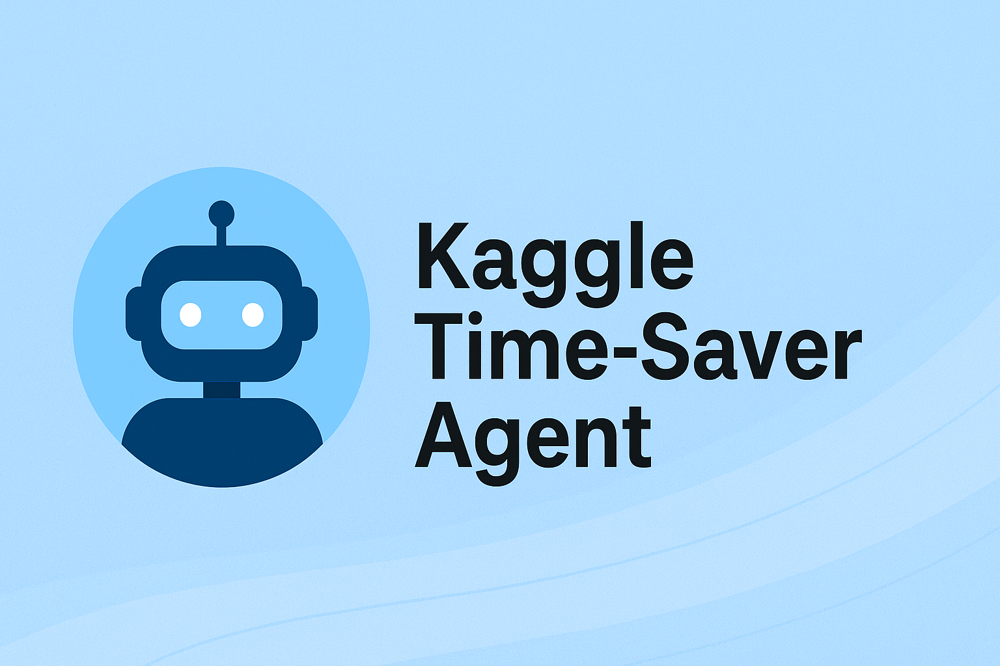

<p align="center">
  
</p>

# Kaggle Time-Saver Agent

Kaggle Time-Saver Agent is an AI-powered dataset assistant designed to automate data analysis, visualization, reporting, and Kaggle dataset downloads. It combines Google Gemini function-calling with a modular Python backend and an interactive Streamlit dashboard.

---

## Live Demo

- Streamlit App: https://kaggle-time-saver-agent-e4dytd65tutyyw9cm5knfu.streamlit.app/
- Google Colab Notebook (full development workflow): https://colab.research.google.com/drive/133RXsuoKAmaIEOrjS6YL_AMoNbvGNvwV?usp=sharing

---

## Overview

This system acts as an AI assistant for dataset understanding. It supports:

- Natural-language dataset exploration
- Loading and switching between multiple datasets
- Automatic EDA, summary statistics, and missing value analysis
- Chart generation (histograms, bar charts, heatmaps)
- SQL querying using DuckDB
- Machine learning model training and predictions
- Full HTML and PDF report generation
- Kaggle dataset downloading (competition + dataset ID)
- ZIP dataset extraction and one-click loading
- Both CLI mode and Streamlit web UI

---

## Key Features

- AI-based free-form querying using Google Gemini with function calling
- Automatic visual insights
- ML models: Logistic Regression, Random Forest
- SQL data querying
- PDF/HTML report generator
- Multi-dataset memory and switching
- Modular architecture (`modules/`)
- Fully deployable Streamlit interface

---

## Setup Instructions

### 1. Prerequisites

- Python 3 or higher
- Kaggle API credentials
- Google Gemini API key

### 2. Install Dependencies

```bash
pip install -r requirements.txt
```

### 3. Configure API Keys

1. Copy the example environment file:
   ```bash
   copy .env.example .env  # Windows
   # or
   cp .env.example .env    # Linux/Mac
   ```

2. Edit `.env` and add your credentials:
   ```
   GOOGLE_API_KEY=your_google_api_key_here
   KAGGLE_USERNAME=your_kaggle_username
   KAGGLE_KEY=your_kaggle_api_key
   ```

   **Getting API Keys:**
   - **Google Gemini API**: Get from [Google AI Studio](https://makersuite.google.com/app/apikey)
   - **Kaggle API**: Get from [Kaggle Settings](https://www.kaggle.com/settings) → API section

### 4. Run the Application

```bash
python app.py
```

## Usage

### Running the Streamlit Web App (Recommended)

```bash
streamlit run streamlit_app.py
```

The app will open in your browser at `http://localhost:8501`

### Running the CLI Version

```bash
python app.py
```

---

## Using the Streamlit App

The web interface supports:

1. Loading datasets from:
   - Kaggle competitions
   - Kaggle dataset IDs
   - Local CSV files
   - ZIP archives (auto-detected and extracted)

2. AI analysis including:
   - Data summaries
   - Column descriptions
   - Correlation heatmaps
   - Histogram and bar charts
   - SQL querying
   - Machine learning model training
   - Report generation (HTML/PDF)

3. Multi-dataset management with names and switching.

---

### Example Queries

Once the agent is running, you can ask questions like:

```
🤖 You: What columns are in the dataset?
🤖 You: Show me statistics for the Age column
🤖 You: How many missing values are there?
🤖 You: Train a random_forest model
🤖 You: Predict survival for Pclass=3, Sex=male, Age=30, Fare=7.25
```

---

## 🏷️ Badges


---

## Development

To extend the agent with new tools:

1. Add your function to `modules/agent.py`
2. Create a function declaration dictionary
3. Add it to the appropriate declarations list
4. Update `rebuild_tool_schema()` to include your new tool

---

## License

This project is part of the Google x Kaggle 5-day intensive AI training capstone project.

## Acknowledgments

- Google Gemini AI for the function calling capabilities
- Kaggle for dataset access
- All the open-source libraries that make this project possible
